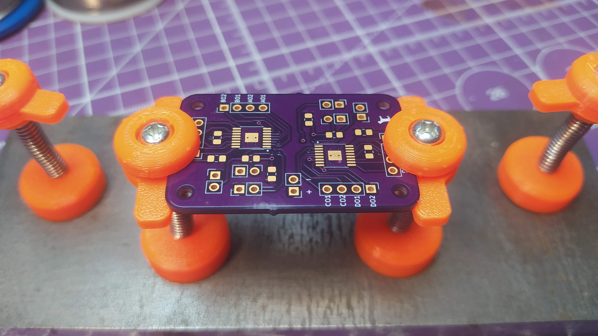
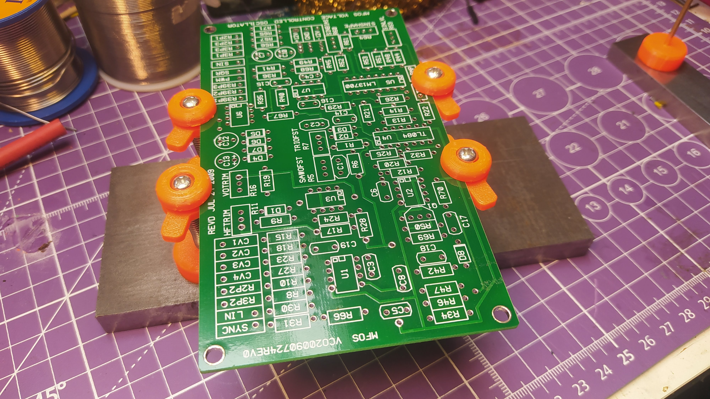
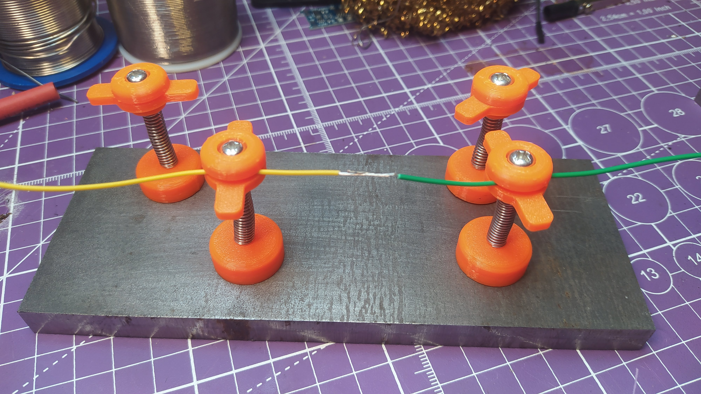

# magnet_pcb_clamps
## A 3D printable spring loaded magnet based PCB clamp system. 

  

  

  

These printable clamps consist of 3 3D printed sections, the top clamp section is fixed and the floating clamp section with small arms rests on a spring.
The springs I have used/found are 5.6mm diameter and 38mm long with a wire thickness of 0.4mm. However anything near this size will work. 
The bases have a small hexagonal void to hold a M4 nut, which I secure with some small drops of superglue. 
The bases are then finished with a 12mm x 2mm neodymium magnet which is a push fit into the base, but also can be secured with a drop of superglue.
The bolts/machine screws that pass through the clamps are M4 by 40mm, but you can adjust the height of the bolt and spring if needed. 
All the files are made in the wonderful FreeCAD version 1,01 so you can easily adapt the models for example if you have hex head bolts etc.  

So for each clamp the complete BOM is;  
 
-1 x top clamp section  
-1 x floating clamp section  
-1 x base section  
-1 x M4 bolt/machine screw  
-1 x compression spring  
